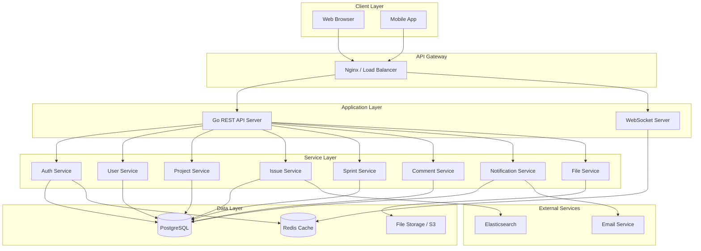
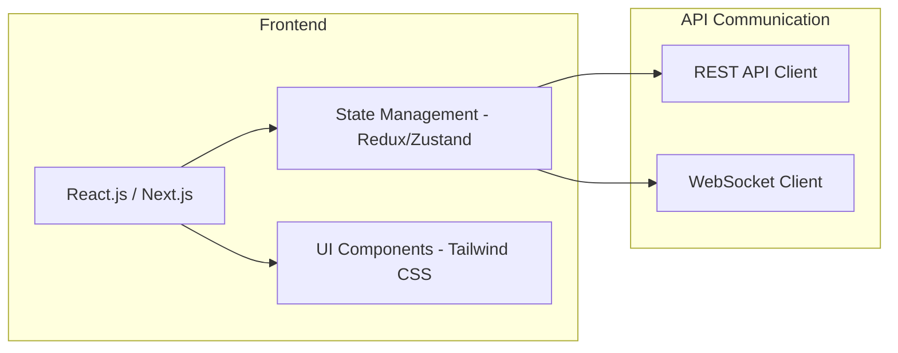
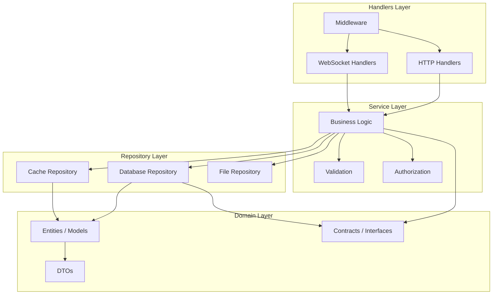
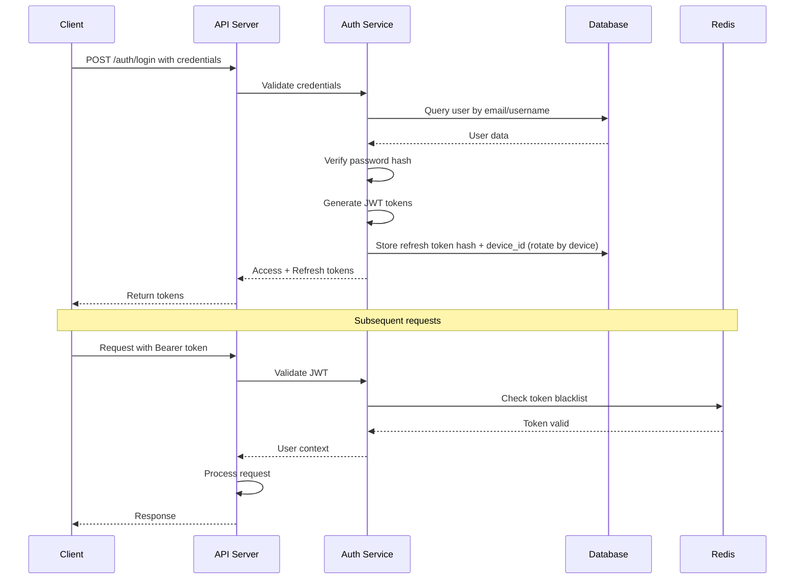
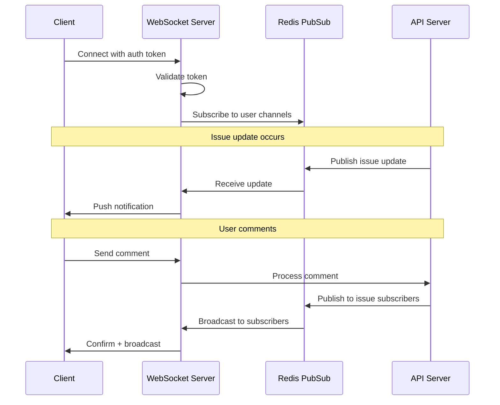
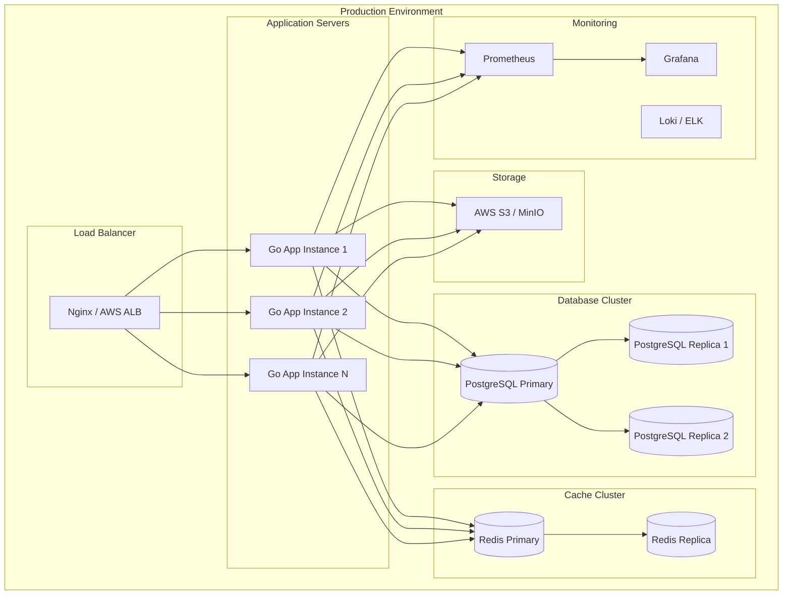

# Mini Jira - System Architecture

## Overview
This document describes the system architecture for a Jira-like project management application built with Go.

## High-Level Architecture



## Component Architecture

### 1. Presentation Layer



### 2. Backend Architecture - Clean Architecture



## Directory Structure

```
mini_jira/
├── cmd/
│   └── app/
│       └── app.go              # Application entry point
├── config/
│   └── config.go               # Configuration management
├── contract/
│   ├── repository.go           # Repository interfaces
│   └── service.go              # Service interfaces
├── docs/
│   ├── complete-erd.md         # Database ERD
│   ├── architecture.md         # This file
│   └── requirements.md         # Requirements document
├── dto/
│   └── dto.go                  # Data Transfer Objects
├── handler/
│   ├── handler.go              # Base handler
│   ├── auth_handler.go         # Authentication handlers
│   ├── user_handler.go         # User handlers
│   ├── project_handler.go      # Project handlers
│   ├── issue_handler.go        # Issue handlers
│   ├── sprint_handler.go       # Sprint handlers
│   ├── comment_handler.go      # Comment handlers
│   └── notification_handler.go # Notification handlers
├── internal/
│   ├── database/
│   │   └── database.go         # Database connection
│   └── server/
│       └── server.go           # HTTP server setup
├── middleware/
│   └── middleware.go           # HTTP middleware
├── migrations/
│   └── migrations.go           # Database migrations
├── models/
│   ├── user.go                 # User model
│   ├── project.go              # Project model
│   ├── issue.go                # Issue model
│   ├── sprint.go               # Sprint model
│   ├── comment.go              # Comment model
│   └── ...                     # Other models
├── repository/
│   ├── repository.go           # Base repository
│   ├── user_repository.go      # User repository
│   ├── project_repository.go   # Project repository
│   ├── issue_repository.go     # Issue repository
│   └── ...                     # Other repositories
├── routes/
│   └── routes.go               # Route definitions
├── service/
│   ├── service.go              # Base service
│   ├── auth_service.go         # Authentication service
│   ├── user_service.go         # User service
│   ├── project_service.go      # Project service
│   ├── issue_service.go        # Issue service
│   └── ...                     # Other services
├── utils/
│   ├── utils.go                # Utility functions
│   └── compare.go              # Comparison utilities
├── .env                        # Environment variables
├── .air.toml                   # Hot reload config
├── go.mod                      # Go modules
├── go.sum                      # Go dependencies
└── main.go                     # Main entry point
```

## API Design

### RESTful API Endpoints

```
Authentication:
POST   /api/v1/auth/register     - Register new user
POST   /api/v1/auth/login        - User login
POST   /api/v1/auth/logout       - User logout
POST   /api/v1/auth/refresh      - Refresh token
POST   /api/v1/auth/forgot       - Forgot password
POST   /api/v1/auth/reset        - Reset password

Users:
GET    /api/v1/users             - List users
GET    /api/v1/users/:id         - Get user by ID
PUT    /api/v1/users/:id         - Update user
DELETE /api/v1/users/:id         - Delete user
GET    /api/v1/users/me          - Get current user

Projects:
GET    /api/v1/projects          - List projects
POST   /api/v1/projects          - Create project
GET    /api/v1/projects/:id      - Get project
PUT    /api/v1/projects/:id      - Update project
DELETE /api/v1/projects/:id      - Delete project
GET    /api/v1/projects/:id/members    - List project members
POST   /api/v1/projects/:id/members    - Add project member
DELETE /api/v1/projects/:id/members/:userId - Remove member

Sprints:
GET    /api/v1/projects/:id/sprints    - List sprints
POST   /api/v1/projects/:id/sprints    - Create sprint
GET    /api/v1/sprints/:id             - Get sprint
PUT    /api/v1/sprints/:id             - Update sprint
DELETE /api/v1/sprints/:id             - Delete sprint
POST   /api/v1/sprints/:id/start       - Start sprint
POST   /api/v1/sprints/:id/complete    - Complete sprint

Issues:
GET    /api/v1/projects/:id/issues     - List issues
POST   /api/v1/projects/:id/issues     - Create issue
GET    /api/v1/issues/:id              - Get issue
PUT    /api/v1/issues/:id              - Update issue
DELETE /api/v1/issues/:id              - Delete issue
PUT    /api/v1/issues/:id/assign       - Assign issue
PUT    /api/v1/issues/:id/status       - Update status
PUT    /api/v1/issues/:id/move         - Move to sprint
GET    /api/v1/issues/:id/history      - Get issue history

Comments:
GET    /api/v1/issues/:id/comments     - List comments
POST   /api/v1/issues/:id/comments     - Add comment
PUT    /api/v1/comments/:id            - Update comment
DELETE /api/v1/comments/:id            - Delete comment

Worklogs:
GET    /api/v1/issues/:id/worklogs     - List worklogs
POST   /api/v1/issues/:id/worklogs     - Add worklog
PUT    /api/v1/worklogs/:id            - Update worklog
DELETE /api/v1/worklogs/:id            - Delete worklog

Attachments:
GET    /api/v1/issues/:id/attachments  - List attachments
POST   /api/v1/issues/:id/attachments  - Upload attachment
DELETE /api/v1/attachments/:id         - Delete attachment
GET    /api/v1/attachments/:id/download - Download attachment

Labels:
GET    /api/v1/projects/:id/labels     - List labels
POST   /api/v1/projects/:id/labels     - Create label
PUT    /api/v1/labels/:id              - Update label
DELETE /api/v1/labels/:id              - Delete label

Notifications:
GET    /api/v1/notifications           - List notifications
PUT    /api/v1/notifications/:id/read  - Mark as read
PUT    /api/v1/notifications/read-all  - Mark all as read

Search:
GET    /api/v1/search/issues           - Search issues
GET    /api/v1/search/projects         - Search projects
```

## Authentication Flow



Notes:
- Refresh tokens are stored as HMAC-SHA256 hashes (no raw tokens in storage).
- Each refresh token is bound to a `device_id`. Login/refresh rotates and revokes prior refresh tokens for the same device.

## Real-time Updates with WebSocket



## Deployment Architecture



## Technology Stack

### Backend
| Component | Technology | Purpose |
|-----------|------------|---------|
| Language | Go 1.21+ | Main programming language |
| Web Framework | Gin / Echo | HTTP routing and middleware |
| ORM | GORM | Database operations |
| Authentication | JWT | Token-based auth |
| Validation | go-playground/validator | Input validation |
| Configuration | Viper | Config management |
| Logging | Zap / Zerolog | Structured logging |
| Testing | testify | Unit and integration tests |

### Database
| Component | Technology | Purpose |
|-----------|------------|---------|
| Primary DB | PostgreSQL 15+ | Main data storage |
| Cache | Redis 7+ | Caching and sessions |
| Search | Elasticsearch | Full-text search |
| Migrations | golang-migrate | Database migrations |

### Frontend
| Component | Technology | Purpose |
|-----------|------------|---------|
| Framework | React 18+ / Next.js 14+ | UI framework |
| State | Redux Toolkit / Zustand | State management |
| Styling | Tailwind CSS | Styling |
| UI Library | shadcn/ui | Component library |
| HTTP Client | Axios / TanStack Query | API communication |
| WebSocket | Socket.io-client | Real-time updates |

### DevOps
| Component | Technology | Purpose |
|-----------|------------|---------|
| Containerization | Docker | Container runtime |
| Orchestration | Docker Compose / K8s | Container orchestration |
| CI/CD | GitHub Actions | Automation |
| Monitoring | Prometheus + Grafana | Metrics and dashboards |
| Logging | Loki / ELK Stack | Log aggregation |
| Reverse Proxy | Nginx | Load balancing |

## Security Considerations

### Authentication & Authorization
- JWT-based authentication with access and refresh tokens
- Role-based access control (RBAC)
- Project-level permissions
- Password hashing with bcrypt
- Rate limiting on auth endpoints

### Data Protection
- HTTPS/TLS encryption in transit
- Database encryption at rest
- Input validation and sanitization
- SQL injection prevention via ORM
- XSS protection
- CSRF tokens for forms

### API Security
- API rate limiting
- Request size limits
- CORS configuration
- Security headers (Helmet)
- API versioning

## Scalability Considerations

### Horizontal Scaling
- Stateless application design
- Session storage in Redis
- Database read replicas
- Load balancer distribution

### Performance Optimization
- Database query optimization
- Caching strategy (Redis)
- Connection pooling
- Pagination for large datasets
- Lazy loading for attachments

### High Availability
- Multiple application instances
- Database replication
- Redis clustering
- Health checks and auto-recovery
