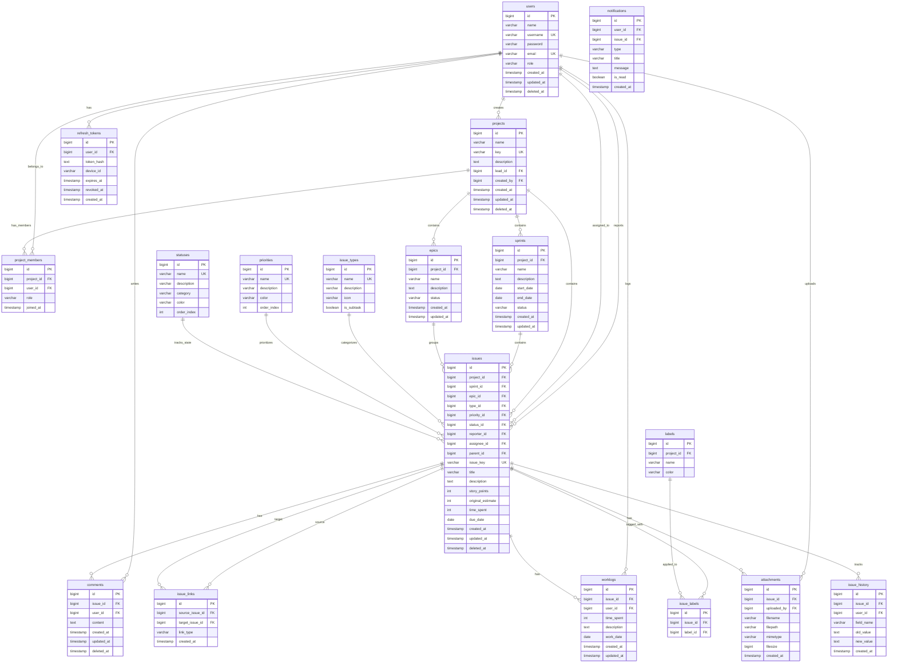

# Mini Jira - Complete Entity Relationship Diagram (ERD)

## Overview
This document describes the complete database schema for a Jira-like project management system.

## ERD Diagram (Mermaid)



## Entity Descriptions

### 1. users
User accounts for the system.

| Column | Type | Constraints | Description |
|--------|------|-------------|-------------|
| id | bigint | PK, Auto Increment | Unique identifier |
| name | varchar(100) | NOT NULL | Full name |
| username | varchar(100) | UNIQUE, NOT NULL | Login username |
| password | varchar(255) | NOT NULL | Hashed password |
| email | varchar(100) | UNIQUE, NOT NULL | Email address |
| role | varchar(50) | NOT NULL, DEFAULT 'member' | User role (admin, project_manager, member) |
| created_at | timestamp | NOT NULL | Creation timestamp |
| updated_at | timestamp | NOT NULL | Last update timestamp |
| deleted_at | timestamp | NULLABLE | Soft delete timestamp |

### 2. projects
Projects that contain issues and sprints.

| Column | Type | Constraints | Description |
|--------|------|-------------|-------------|
| id | bigint | PK, Auto Increment | Unique identifier |
| name | varchar(255) | NOT NULL | Project name |
| key | varchar(10) | UNIQUE, NOT NULL | Project key (e.g., PROJ) |
| description | text | NULLABLE | Project description |
| lead_id | bigint | FK → users.id | Project lead |
| created_by | bigint | FK → users.id | Creator |
| created_at | timestamp | NOT NULL | Creation timestamp |
| updated_at | timestamp | NOT NULL | Last update timestamp |
| deleted_at | timestamp | NULLABLE | Soft delete timestamp |

### 3. project_members
Many-to-many relationship between users and projects.

| Column | Type | Constraints | Description |
|--------|------|-------------|-------------|
| id | bigint | PK, Auto Increment | Unique identifier |
| project_id | bigint | FK → projects.id, NOT NULL | Project reference |
| user_id | bigint | FK → users.id, NOT NULL | User reference |
| role | varchar(50) | NOT NULL | Member role in project |
| joined_at | timestamp | NOT NULL | Join timestamp |

**Unique Constraint:** (project_id, user_id)

### 4. sprints
Sprints for agile development within projects.

| Column | Type | Constraints | Description |
|--------|------|-------------|-------------|
| id | bigint | PK, Auto Increment | Unique identifier |
| project_id | bigint | FK → projects.id, NOT NULL | Project reference |
| name | varchar(255) | NOT NULL | Sprint name |
| description | text | NULLABLE | Sprint description |
| start_date | date | NOT NULL | Sprint start date |
| end_date | date | NOT NULL | Sprint end date |
| status | varchar(50) | NOT NULL, DEFAULT 'planned' | Sprint status |
| created_at | timestamp | NOT NULL | Creation timestamp |
| updated_at | timestamp | NOT NULL | Last update timestamp |

**Status Values:** planned, active, completed

### 5. epics
Large features that group related issues.

| Column | Type | Constraints | Description |
|--------|------|-------------|-------------|
| id | bigint | PK, Auto Increment | Unique identifier |
| project_id | bigint | FK → projects.id, NOT NULL | Project reference |
| name | varchar(255) | NOT NULL | Epic name |
| description | text | NULLABLE | Epic description |
| status | varchar(50) | NOT NULL, DEFAULT 'open' | Epic status |
| created_at | timestamp | NOT NULL | Creation timestamp |
| updated_at | timestamp | NOT NULL | Last update timestamp |

### 6. issues
Main entity for tasks, bugs, stories, etc.

| Column | Type | Constraints | Description |
|--------|------|-------------|-------------|
| id | bigint | PK, Auto Increment | Unique identifier |
| project_id | bigint | FK → projects.id, NOT NULL | Project reference |
| sprint_id | bigint | FK → sprints.id, NULLABLE | Sprint reference |
| epic_id | bigint | FK → epics.id, NULLABLE | Epic reference |
| type_id | bigint | FK → issue_types.id, NOT NULL | Issue type |
| priority_id | bigint | FK → priorities.id, NOT NULL | Priority level |
| status_id | bigint | FK → statuses.id, NOT NULL | Current status |
| reporter_id | bigint | FK → users.id, NOT NULL | Issue reporter |
| assignee_id | bigint | FK → users.id, NULLABLE | Assigned user |
| parent_id | bigint | FK → issues.id, NULLABLE | Parent issue (for subtasks) |
| issue_key | varchar(20) | UNIQUE, NOT NULL | Issue key (e.g., PROJ-123) |
| title | varchar(500) | NOT NULL | Issue title |
| description | text | NULLABLE | Issue description |
| story_points | int | NULLABLE | Story points estimate |
| original_estimate | int | NULLABLE | Original time estimate (minutes) |
| time_spent | int | DEFAULT 0 | Total time spent (minutes) |
| due_date | date | NULLABLE | Due date |
| created_at | timestamp | NOT NULL | Creation timestamp |
| updated_at | timestamp | NOT NULL | Last update timestamp |
| deleted_at | timestamp | NULLABLE | Soft delete timestamp |

### 7. issue_types
Types of issues (Task, Bug, Story, Epic, Subtask).

| Column | Type | Constraints | Description |
|--------|------|-------------|-------------|
| id | bigint | PK, Auto Increment | Unique identifier |
| name | varchar(50) | UNIQUE, NOT NULL | Type name |
| description | varchar(255) | NULLABLE | Type description |
| icon | varchar(100) | NULLABLE | Icon identifier |
| is_subtask | boolean | DEFAULT false | Is this a subtask type |

**Default Values:**
- Task
- Bug
- Story
- Epic
- Subtask

### 8. priorities
Priority levels for issues.

| Column | Type | Constraints | Description |
|--------|------|-------------|-------------|
| id | bigint | PK, Auto Increment | Unique identifier |
| name | varchar(50) | UNIQUE, NOT NULL | Priority name |
| description | varchar(255) | NULLABLE | Priority description |
| color | varchar(20) | NULLABLE | Display color |
| order_index | int | NOT NULL | Sort order |

**Default Values:**
- Highest (order: 1, color: #FF0000)
- High (order: 2, color: #FF6B6B)
- Medium (order: 3, color: #FFD93D)
- Low (order: 4, color: #6BCB77)
- Lowest (order: 5, color: #4D96FF)

### 9. statuses
Status workflow for issues.

| Column | Type | Constraints | Description |
|--------|------|-------------|-------------|
| id | bigint | PK, Auto Increment | Unique identifier |
| name | varchar(50) | UNIQUE, NOT NULL | Status name |
| description | varchar(255) | NULLABLE | Status description |
| category | varchar(50) | NOT NULL | Status category |
| color | varchar(20) | NULLABLE | Display color |
| order_index | int | NOT NULL | Sort order |

**Default Values:**
- To Do (category: todo)
- In Progress (category: in_progress)
- In Review (category: in_progress)
- Done (category: done)

### 10. labels
Labels for categorizing issues.

| Column | Type | Constraints | Description |
|--------|------|-------------|-------------|
| id | bigint | PK, Auto Increment | Unique identifier |
| project_id | bigint | FK → projects.id, NOT NULL | Project reference |
| name | varchar(100) | NOT NULL | Label name |
| color | varchar(20) | NULLABLE | Display color |

**Unique Constraint:** (project_id, name)

### 11. issue_labels
Many-to-many relationship between issues and labels.

| Column | Type | Constraints | Description |
|--------|------|-------------|-------------|
| id | bigint | PK, Auto Increment | Unique identifier |
| issue_id | bigint | FK → issues.id, NOT NULL | Issue reference |
| label_id | bigint | FK → labels.id, NOT NULL | Label reference |

**Unique Constraint:** (issue_id, label_id)

### 12. comments
Comments on issues.

| Column | Type | Constraints | Description |
|--------|------|-------------|-------------|
| id | bigint | PK, Auto Increment | Unique identifier |
| issue_id | bigint | FK → issues.id, NOT NULL | Issue reference |
| user_id | bigint | FK → users.id, NOT NULL | Comment author |
| content | text | NOT NULL | Comment content |
| created_at | timestamp | NOT NULL | Creation timestamp |
| updated_at | timestamp | NOT NULL | Last update timestamp |
| deleted_at | timestamp | NULLABLE | Soft delete timestamp |

### 13. worklogs
Time tracking entries for issues.

| Column | Type | Constraints | Description |
|--------|------|-------------|-------------|
| id | bigint | PK, Auto Increment | Unique identifier |
| issue_id | bigint | FK → issues.id, NOT NULL | Issue reference |
| user_id | bigint | FK → users.id, NOT NULL | User who logged time |
| time_spent | int | NOT NULL | Time spent (minutes) |
| description | text | NULLABLE | Work description |
| work_date | date | NOT NULL | Date of work |
| created_at | timestamp | NOT NULL | Creation timestamp |
| updated_at | timestamp | NOT NULL | Last update timestamp |

### 14. attachments
File attachments for issues.

| Column | Type | Constraints | Description |
|--------|------|-------------|-------------|
| id | bigint | PK, Auto Increment | Unique identifier |
| issue_id | bigint | FK → issues.id, NOT NULL | Issue reference |
| uploaded_by | bigint | FK → users.id, NOT NULL | Uploader |
| filename | varchar(255) | NOT NULL | Original filename |
| filepath | varchar(500) | NOT NULL | Storage path |
| mimetype | varchar(100) | NOT NULL | File MIME type |
| filesize | bigint | NOT NULL | File size in bytes |
| created_at | timestamp | NOT NULL | Upload timestamp |

### 15. issue_links
Links between related issues.

| Column | Type | Constraints | Description |
|--------|------|-------------|-------------|
| id | bigint | PK, Auto Increment | Unique identifier |
| source_issue_id | bigint | FK → issues.id, NOT NULL | Source issue |
| target_issue_id | bigint | FK → issues.id, NOT NULL | Target issue |
| link_type | varchar(50) | NOT NULL | Type of link |
| created_at | timestamp | NOT NULL | Creation timestamp |

**Link Types:**
- blocks / is_blocked_by
- duplicates / is_duplicated_by
- relates_to
- clones / is_cloned_by

### 16. issue_history
Audit trail for issue changes.

| Column | Type | Constraints | Description |
|--------|------|-------------|-------------|
| id | bigint | PK, Auto Increment | Unique identifier |
| issue_id | bigint | FK → issues.id, NOT NULL | Issue reference |
| user_id | bigint | FK → users.id, NOT NULL | User who made change |
| field_name | varchar(100) | NOT NULL | Changed field name |
| old_value | text | NULLABLE | Previous value |
| new_value | text | NULLABLE | New value |
| created_at | timestamp | NOT NULL | Change timestamp |

### 17. notifications
User notifications.

| Column | Type | Constraints | Description |
|--------|------|-------------|-------------|
| id | bigint | PK, Auto Increment | Unique identifier |
| user_id | bigint | FK → users.id, NOT NULL | Recipient user |
| issue_id | bigint | FK → issues.id, NULLABLE | Related issue |
| type | varchar(50) | NOT NULL | Notification type |
| title | varchar(255) | NOT NULL | Notification title |
| message | text | NULLABLE | Notification message |
| is_read | boolean | DEFAULT false | Read status |
| created_at | timestamp | NOT NULL | Creation timestamp |

**Notification Types:**
- issue_assigned
- issue_updated
- comment_added
- mentioned
- sprint_started
- sprint_ended

### 18. refresh_tokens
Refresh tokens for session renewal.

| Column | Type | Constraints | Description |
|--------|------|-------------|-------------|
| id | bigint | PK, Auto Increment | Unique identifier |
| user_id | bigint | FK → users.id, NOT NULL | Token owner |
| token_hash | text | UNIQUE, NOT NULL | HMAC-SHA256 of refresh token |
| device_id | varchar(128) | NOT NULL | Device identifier |
| expires_at | timestamp | NOT NULL | Expiration timestamp |
| revoked_at | timestamp | NULLABLE | Revocation timestamp |
| created_at | timestamp | NOT NULL | Creation timestamp |

## Indexes

### Performance Indexes
```sql
-- Users
CREATE INDEX idx_users_email ON users(email);
CREATE INDEX idx_users_username ON users(username);

-- Projects
CREATE INDEX idx_projects_key ON projects(key);
CREATE INDEX idx_projects_lead ON projects(lead_id);

-- Issues
CREATE INDEX idx_issues_project ON issues(project_id);
CREATE INDEX idx_issues_sprint ON issues(sprint_id);
CREATE INDEX idx_issues_assignee ON issues(assignee_id);
CREATE INDEX idx_issues_reporter ON issues(reporter_id);
CREATE INDEX idx_issues_status ON issues(status_id);
CREATE INDEX idx_issues_key ON issues(issue_key);
CREATE INDEX idx_issues_created ON issues(created_at);

-- Comments
CREATE INDEX idx_comments_issue ON comments(issue_id);
CREATE INDEX idx_comments_user ON comments(user_id);

-- Worklogs
CREATE INDEX idx_worklogs_issue ON worklogs(issue_id);
CREATE INDEX idx_worklogs_user ON worklogs(user_id);

-- Notifications
CREATE INDEX idx_notifications_user ON notifications(user_id);
CREATE INDEX idx_notifications_read ON notifications(user_id, is_read);

-- Issue History
CREATE INDEX idx_issue_history_issue ON issue_history(issue_id);
CREATE INDEX idx_issue_history_created ON issue_history(created_at);

-- Refresh Tokens
CREATE INDEX idx_refresh_tokens_user_id ON refresh_tokens(user_id);
CREATE INDEX idx_refresh_tokens_device_id ON refresh_tokens(device_id);
CREATE INDEX idx_refresh_tokens_expires_at ON refresh_tokens(expires_at);
CREATE INDEX idx_refresh_tokens_revoked_at ON refresh_tokens(revoked_at);
CREATE INDEX idx_refresh_tokens_user_device ON refresh_tokens(user_id, device_id);
```

## Data Integrity Rules

1. **Soft Delete:** Soft delete is used for main entities (users, projects, issues, comments)
2. **Cascade Delete:** When a project is deleted, related sprints, issues, and labels are soft deleted
3. **Foreign Key Constraints:** All foreign keys have ON DELETE RESTRICT by default
4. **Required Fields:** Required fields cannot be null
5. **Default Values:** Roles, statuses, and priorities have sensible defaults
